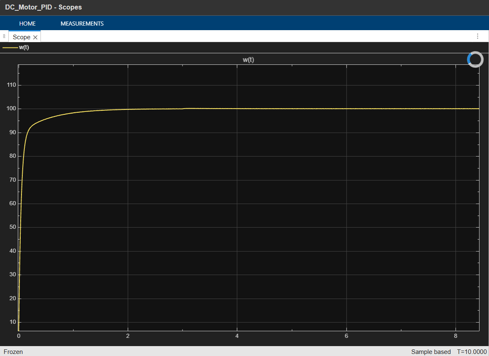
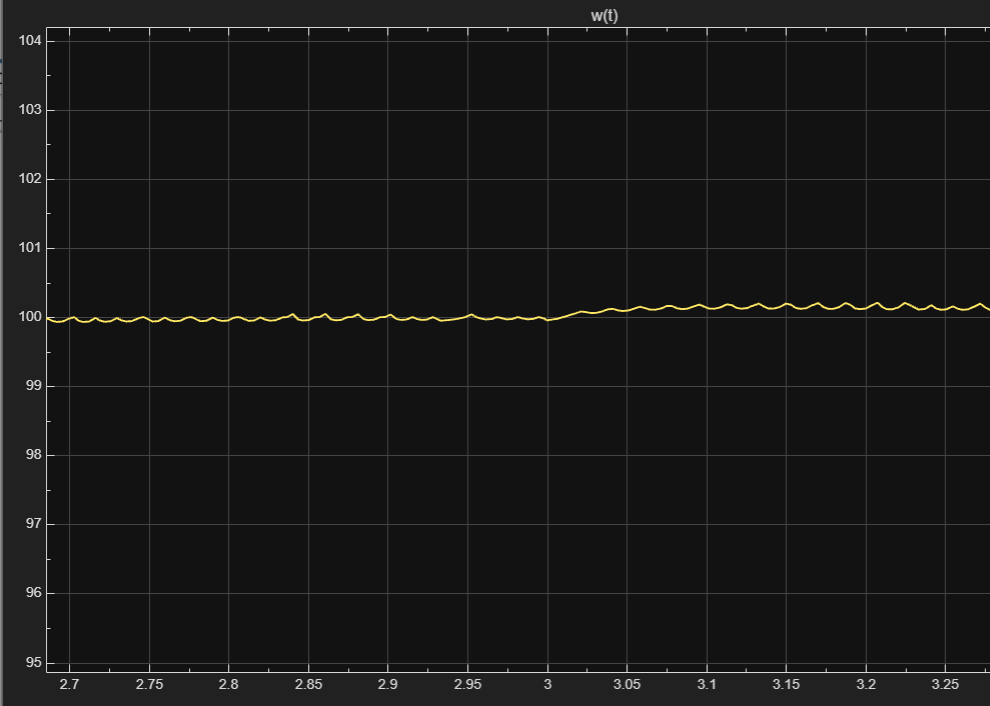

# PID Speed Controller for DC Motor — MATLAB/Simulink

## Overview

Closed-loop PID speed controller for a DC motor, built from scratch in MATLAB/Simulink.
Modelled the motor physics from first principles and tuned the PID gains manually.
**Target:** 100 rad/s reference speed
**Final Gains:** Kp = 100, Ki = 200, Kd = 0

## Results
## Scope Results ### Step Response  ### Disturbance Rejection at
t=3s 

| Metric | Value |
|--------|-------|
| Rise Time | ~0.3 seconds |
| Settling Time | ~2 seconds |
| Overshoot | < 5% |
| Steady-State Error | Zero |
| Disturbance Recovery | < 0.1 seconds |

## Project Structure- DC_Motor_PID.slx — Simulink model file- step_response.png — Closed-loop step response- disturbance_rejection.png — Disturbance rejection test at t=3s

## Motor Parameters

| Symbol | Parameter | Value |
|--------|-----------|-------|
| R | Armature resistance | 1.0 Ohm |
| L | Armature inductance | 0.5 H |
| Kt | Torque constant | 0.01 N.m/A |
| Kb | Back-EMF constant | 0.01 V.s/rad |
| J | Rotor inertia | 0.01 kg.m2 |
| B | Friction coefficient | 0.1 N.m.s/rad |

## What I Built- DC motor plant modelled as two subsystems:- Electrical: Armature circuit (di/dt equation)- Mechanical: Rotor dynamics (dw/dt equation)- Parallel-form PID controller with anti-windup (clamping)- Closed-loop feedback system- Disturbance rejection test (step load at t=3s)

## Key Learning

Removed Kd entirely — the motor's natural friction damping (B=0.1)
was sufficient. Adding derivative action caused instability for this
specific motor. Engineering decision: know what NOT to add.

## Tools Used- MATLAB R2021+- Simulink- Manual PID tuning (no auto-tuner)

## Author
Sumit Kumar
B.Tech Electrical Engineering, NIT Agartala '28
Silver Medalist — Diploma in EE, Bihar
